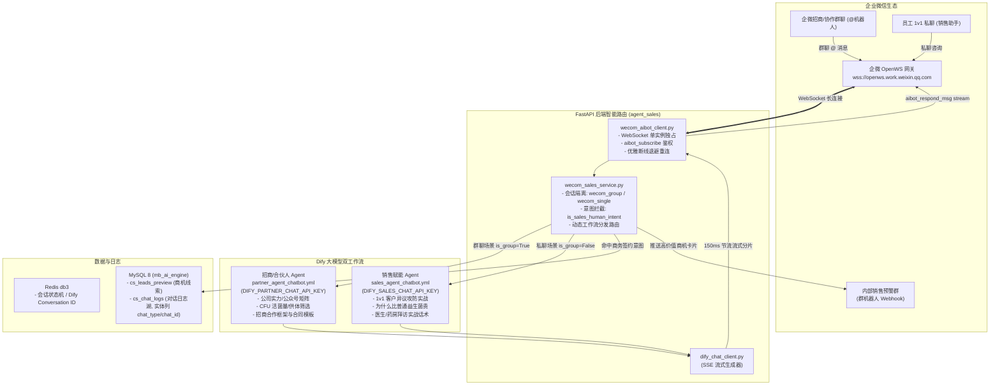

# 企业微信智能机器人（API 模式 / WebSocket 长连接）技术与运维指南

> 本文档整理自企业微信智能机器人（AI Bot）长连接接入的设计方案、实现细节、双工作流分发与线上故障排查归档。

---

## 1. 企微接入渠道选型与准入规则（必读）

### 1.1 为什么群聊必须使用「智能机器人 (AIBot)」，自建应用不行？

在企业微信生态中，有两种常见的开发者能力，其适用场景与限制存在本质差异：

| 对比维度 | 企微自建应用 (Custom App) | 企微智能机器人 (AI Bot - API 模式) |
| :--- | :--- | :--- |
| **群聊拉入能力** | ❌ **无法作为聊天机器人被拉入群聊**（企微官方限制：应用只能用于工作台卡片或应用单聊，不能进群 @ 互动） | ✅ **原生支持拉入各类群聊**（内部群、外部群、跨企业协作群、招商群） |
| **交互模式** | 仅支持被动 HTTP Webhook 回调推送 | ✅ **支持全双工 WebSocket 长连接（`wss://openws.work.weixin.qq.com`）** |
| **流式打字机** | ❌ 不支持（只能整条消息单次回复） | ✅ **原生支持 Stream 打字机逐字上屏（150ms 节流输出）** |
| **使用场景** | 内部员工打卡、工作审批、公告单向推送 | **7×24h 智能客服、招商群自动答疑、1v1 销售作战助手** |

> **核心结论**：要实现在企微群聊内 `@机器人` 自动答疑、商机识别与 1v1 销售话术赋能，**必须在企微管理后台创建「智能机器人（选择 API 模式）」**，获取 `Bot ID` 和 `Secret` 建立 WebSocket 长连接。

---

## 2. 系统双 Agent 工作流与架构拓扑

针对 B 端招商群与内部销售 1v1 赋能的不同业务目标，系统拆分为两大独立的 Dify Workflow：



---

## 3. Dify 双工作流配置与提示词设计

### 3.1 招商 Agent (`partner_agent_chatbot.yml`)
* **适用渠道**：企业微信内部招商群、外部代理商交流群；
* **环境变量**：`DIFY_PARTNER_CHAT_API_KEY`；
* **定位与核心内容**：
  1. 公司背景与官方公众号矩阵；
  2. 产品优势、CFU 活菌量硬指标、三甲医院临床科研背书；
  3. 严格供体筛选标准（5 大维度、仅 2%~3% 入选率）；
  4. 代理合作政策、合同模板指引；
  5. 商务底价保护：自动转接专属招商总监对接。

### 3.2 销售赋能 Agent (`sales_agent_chatbot.yml`)
* **适用渠道**：员工 1v1 单聊（销售作战助手）；
* **环境变量**：`DIFY_SALES_CHAT_API_KEY`；
* **定位与核心内容**：
  1. 拜访医生、药店、C端大客户的异议处理与攻防话术；
  2. “为什么富玛特活菌胶囊比普通益生菌贵”、“活菌定植率对比”等实战攻防问答；
  3. 移除 C 端急诊拦截，专注于商业谈判与专业学术赋能。

### 3.3 提示词防机器人死板设计原则
* **轻快直击**：问什么答什么，直击核心，拒绝大水漫灌的长篇大论（单次回答严格控制在 150~250 字以内）；
* **拟人化语调**：段落清晰，自然口语化，留出对话追问空间。

---

## 4. 环境变量完整配置清单

在所有 4 份环境配置文件（`.env`、`.env.example`、`backend/.env.example`、`deploy/.env.prod.example`）中严格对齐：

```env
# ==================== 企业微信智能机器人 (API 模式 / WebSocket 长连接) ====================
# 是否启用智能机器人 WebSocket 长连接 Worker（true: 启动 / false: 忽略跳过）
WECOM_AIBOT_ENABLED=true
# 企微智能机器人 Bot ID（从企微管理后台创建的智能机器人中获取）
WECOM_AIBOT_ID=your_bot_id_here
# 企微智能机器人 Secret
WECOM_AIBOT_SECRET=your_bot_secret_here
# 企微智能机器人 WebSocket 接入地址（默认 wss://openws.work.weixin.qq.com）
WECOM_AIBOT_WS_URL=wss://openws.work.weixin.qq.com

# Dify 招商/合伙人 Agent 工作流 API Key（群聊场景优先使用，对应 partner_agent_chatbot.yml）
DIFY_PARTNER_CHAT_API_KEY=app-xxxxxxxxxxxx
# Dify 销售赋能 Agent 工作流 API Key（私聊场景优先使用，对应 sales_agent_chatbot.yml）
DIFY_SALES_CHAT_API_KEY=app-xxxxxxxxxxxx
```

---

## 5. 对话日志湖（`cs_chat_logs`）索引化设计

为了兼顾“全局数据湖统一分析”与“毫秒级场景筛选”，`cs_chat_logs` 采用了**核心检索维度列化 + 动态参数存 JSON** 的工业级标准：

* **实体列（带 B-Tree 索引）**：
  * `chat_type`: `VARCHAR(32)`，记录 `'single'` / `'group'` / `'wxkf'`；
  * `chat_id`: `VARCHAR(128)`，记录企微群聊 ID（单聊为 `NULL`）。
* **JSON 列（`meta`）**：
  * `stream_id`, `conversation_id`, `route`, `retrieval_resources` 等。

---

## 6. 线上运维与常见问题排查归档 (Troubleshooting)

### 6.1 问题一：线上出现双 Worker 顶号踢线（死循环重连）
* **现象**：线上日志每隔 1~2 秒反复出现 `CONNECTING` $\rightarrow$ `CONNECTED` $\rightarrow$ `RECONNECTING`。
* **原因**：`docker-compose.prod.yml` 中配置了 `gunicorn -w 2`，两个独立的 Python 进程同时拿着同一个 Bot ID 连接企微，企微限制单 Bot ID 仅允许 1 条连接，导致两进程死循环互相顶号。
* **解决**：在生产配置中锁定 **`-w 1`（单 Worker 异步独占模式）**。

### 6.2 问题二：报错 `sent 1002 (protocol error) invalid opcode` 或 `keepalive ping timeout`
* **现象**：机器人问答一两轮后，自动报 1002 / 1011 错误断开连接。
* **原因**：企微 OpenWS 网关未实现 WebSocket RFC 6455 Ping 控制帧（Opcode 0x9），客户端主动发 Ping 会被企微返回非标准报文或丢弃。
* **解决**：在 `websockets.connect` 中设置 `ping_interval=None, ping_timeout=None`，完全依靠底层 TCP Keep-Alive 维持稳定连接。

### 6.3 问题三：收到了消息但被判定为 `wecom_aibot_unsupported_msg_type`
* **现象**：用户发送文字消息，控制台记录 `status: IGNORED`。
* **原因**：企微长连接推送的字段名为 `msgtype`（无下划线），代码若仅读取 `msg_type` 会得到 `None`。
* **解决**：在服务端全面兼容 `body.get("msgtype") or body.get("msg_type")` 以及嵌套 `text.content` 报文结构。
